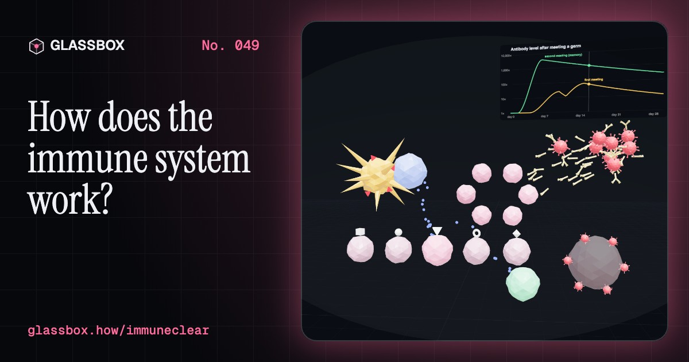
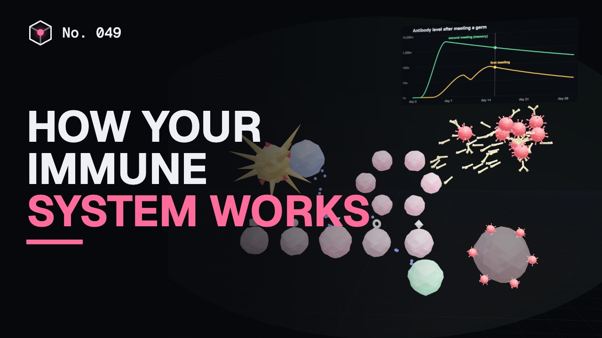
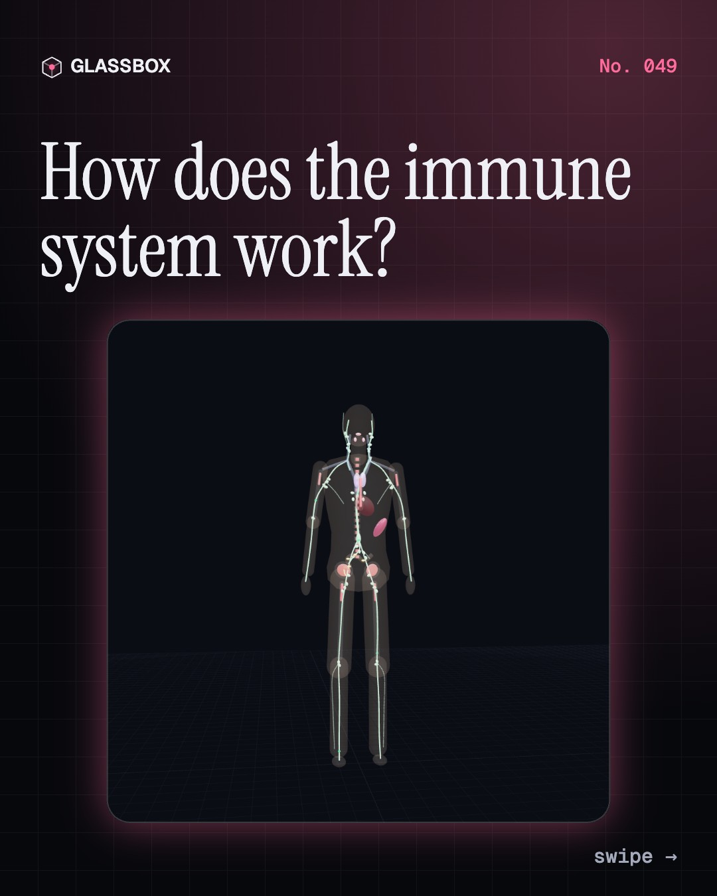
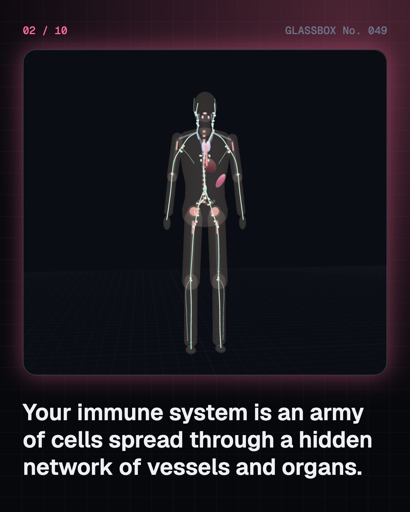
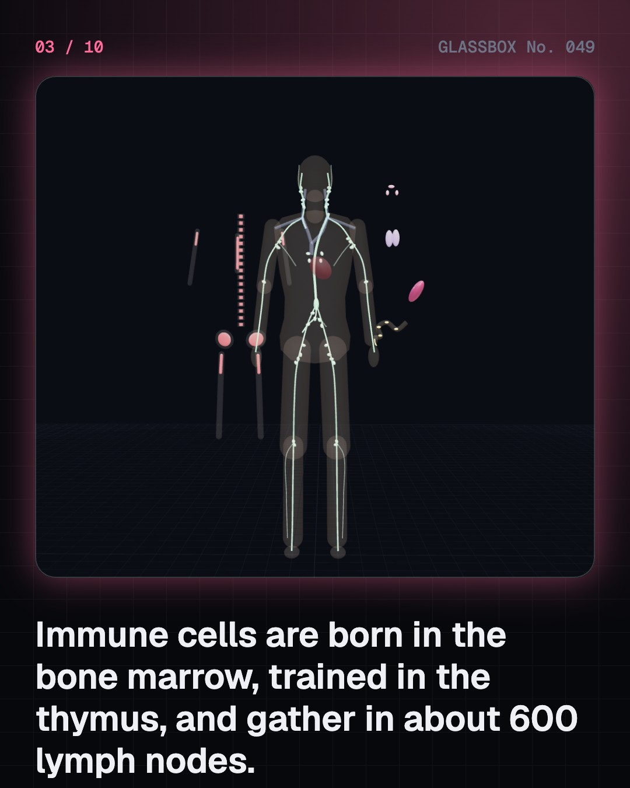
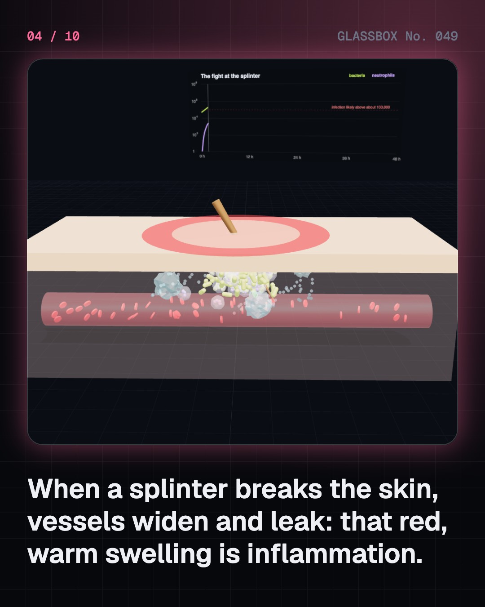

<!-- glassbox:start -->
<!-- Generated from glassbox.json by the Glassbox hub (npm run readme -- immuneclear). Edit glassbox.json, not this block. -->
<p align="center"><a href="https://glassbox.how/e/immuneclear/"></a></p>

<h1 align="center">ImmuneClear</h1>

<p align="center"><b>How does the immune system work?</b><br>Every day your marrow makes about 100 billion new defenders. Push a dirty splinter into the skin and watch neutrophils eat the bacteria, find the one B cell whose receptor fits a virus, and slide a crowd past measles' 93% herd-immunity line.</p>

<p align="center"><a href="https://glassbox.how/immuneclear/"><b>▶ Play with it</b></a> &nbsp;·&nbsp; <a href="https://glassbox.how/e/immuneclear/">Read the 60-second explainer</a> &nbsp;·&nbsp; <a href="https://glassbox.how/immuneclear/glassbox/reel.mp4">Watch the 40-second video</a></p>

<p align="center">
  <a href="https://glassbox.how/e/immuneclear/"></a>
  <a href="https://glassbox.how/e/immuneclear/"></a>
  <a href="LICENSE"></a>
  <a href="LICENSE-CONTENT.md"></a>
  <a href="#privacy"></a>
</p>

## In 60 seconds

1. **An army spread through your body.** Immune cells are born in the red bone marrow, T cells are trained in the thymus, and they gather in about 600 lymph nodes, the tonsils, the spleen and the gut's Peyer's patches. Lymph vessels link them and return 2–3 litres of fluid a day to the blood.
2. **Walls, fire and hungry cells.** Skin, the airway's mucus escalator and stomach acid stop most germs. When a splinter breaks through, vessels widen and leak (redness, heat, swelling) and neutrophils squeeze out to swallow bacteria. Above about 100,000 bacteria the fight can be lost.
3. **Learning the enemy.** A dendritic cell carries pieces of a virus to a lymph node and shows them to helper T cells. The one B cell whose receptor fits multiplies into plasma cells that pour out Y-shaped antibodies, and killer T cells destroy infected cells. The first time takes about a week.
4. **Memory, and training without the danger.** Memory cells answer a second attack in a day or two, with 10–100 times more antibody. Vaccines give the same memory without the illness. When 1 − 1/R0 of people are immune, about 93% for measles, outbreaks fizzle. India has been polio-free since 2014.
5. **The body's drain and filter.** Blood pressure pushes fluid out of capillaries; what isn't drawn back, 2–4 litres a day, drains into dead-end lymph capillaries, is pumped by moving muscles past valves, filtered in lymph nodes and returned to a neck vein. Nodes swell when they fight.
6. **When defences misfire.** Allergies are overreactions, autoimmune diseases like type 1 diabetes attack the body itself, and HIV attacks helper T cells but can be controlled with free treatment. Antibiotics kill bacteria, not viruses. Wash hands, sleep, stay vaccinated, and see a doctor.

## Words worth knowing

| Term | Meaning |
|---|---|
| **Innate immunity** | Fast, general defences you are born with: barriers, inflammation and eater cells. |
| **Adaptive immunity** | Defence that learns each germ's exact shape and remembers it. |
| **Lymph node** | A bean-shaped filter where immune cells meet germs carried in the lymph. |
| **Phagocytosis** | When a neutrophil or macrophage swallows and digests a germ. |
| **Antigen** | A piece of a germ that receptors and antibodies recognise. |
| **Antibody** | A Y-shaped protein made by plasma cells whose two tips lock onto one antigen. |
| **Memory cell** | A long-lived lymphocyte that answers fast if the same germ returns. |
| **Vaccine** | A harmless version or piece of a germ that trains immune memory. |
| **Herd immunity** | When enough people are immune (1 − 1/R0) that a germ can't keep spreading. |

## A short history

**From plague survivors in Athens and smallpox scabs in China to cowpox, eating cells, antibodies, and the end of smallpox and polio in India.**

- **430 BCE** · Survivors don’t catch it twice (Thucydides, Athens)
- **1796** · Cowpox protects against smallpox (Edward Jenner, Berkeley, England)
- **1882** · Cells that eat invaders (Élie Metchnikoff, Messina, Sicily)
- **1885** · Weakened germs make vaccines (Louis Pasteur and colleagues, Paris, France)
- **1890** · Antitoxin: blood that fights a poison (Emil von Behring and Kitasato Shibasaburō, Berlin, Germany)
- **1957** · Clonal selection: the right cell multiplies (Frank Macfarlane Burnet, Melbourne)
- **1975** · Monoclonal antibodies (Georges Köhler and César Milstein, Cambridge, England)
- **1980** · Smallpox is wiped out (World Health Assembly, Geneva)

The full story, with 30 moments, charts, people and 42 sources: [glassbox.how/e/immuneclear/history](https://glassbox.how/e/immuneclear/history/). The data lives in [`history.json`](history.json).

## Video and slides

Made with the Glassbox studio from this box's storyboard (`window.glassbox.director`). Free to reuse under CC BY 4.0.

<a href="https://glassbox.how/immuneclear/glassbox/video.mp4"></a>

<p><a href="glassbox/slide-1.jpg"></a> <a href="glassbox/slide-2.jpg"></a> <a href="glassbox/slide-3.jpg"></a> <a href="glassbox/slide-4.jpg"></a></p>

| File | What | Size |
|---|---|---|
| [`glassbox/reel.mp4`](https://glassbox.how/immuneclear/glassbox/reel.mp4) | Reel / Short, with captions and soundtrack | 1080×1920 |
| [`glassbox/video.mp4`](https://glassbox.how/immuneclear/glassbox/video.mp4) | YouTube video, with captions and soundtrack | 1920×1080 |
| `glassbox/slide-1…10.jpg` | Instagram carousel | 1080×1350 |
| `glassbox/thumb.jpg` | YouTube thumbnail | 1280×720 |
| `glassbox/cover.jpg` | Share card and repo social preview | 1200×630 |
| [`glassbox/history-reel.mp4`](https://glassbox.how/immuneclear/glassbox/history-reel.mp4) | “History in 10 moments” Reel / Short | 1080×1920 |
| `glassbox/history-slide-*.jpg` | History carousel | 1080×1350 |
| `glassbox/post.json` | Post copy and schedule used by the publish kit | |

## Privacy

This box has no accounts and no ads, and it ships its own fonts and libraries. When you run it yourself it sends nothing anywhere. On glassbox.how, the site's `/bar.js` also loads Glassbox's analytics: **Google Analytics** to count visits (it asks first in the EU, UK and Switzerland, and stays off when your browser sends Global Privacy Control or Do Not Track) and **ClickTrust** to detect bots.

It remembers a few things **in your own browser only**, and never sends them anywhere:

| Browser storage key | What it holds |
|---|---|
| `immuneclear.v1` | Which chapters you have opened, your best quiz scores, and sound on or off. |

Exactly what each one sees is at [glassbox.how/privacy](https://glassbox.how/privacy/).

## Licences

- **Code:** [MIT](LICENSE). Use it, change it, ship it.
- **Explanations, text, images and videos** (`glassbox.json`, `glassbox/`): [CC BY 4.0](LICENSE-CONTENT.md). Credit “Glassbox, glassbox.how/e/immuneclear”.
- **Third-party parts** keep their own licences: [three.js](https://threejs.org) (MIT), [Geist, Instrument Serif](https://openfontlicense.org) (SIL OFL 1.1).
- The Glassbox name and logo aren't covered by either licence. See the [terms](https://glassbox.how/terms/).

Found a mistake? [Open an issue](https://github.com/bdeeps/immuneclear/issues). Corrections happen in public.
<!-- glassbox:end -->

## Run it

It's plain HTML, CSS and JavaScript. No build step and no dependencies. Run locally, it contacts no other website.

```bash
python3 -m http.server 8000
```

Three.js and the fonts ship in `vendor/` and `fonts/`, so it also works offline.

Then open http://localhost:8000.

## How it's built

| File | What |
|---|---|
| `index.html`, `css/app.css` | The page and its styles |
| `js/app.js`, `js/stage.js`, `js/ui.js`, `js/kit.js` | The shared Glassbox 3D engine: chapters, 3D stage, controls, quiz, video director |
| `js/chapters/*.js` | One file per chapter: the 3D model, controls, text, key terms, quiz and video scenes |
| `js/immune.js` | Shared models: the ghosted body with lymph vessels, nodes, thymus, spleen, tonsils, Peyer's patches and red marrow; cell shapes (bacteria, viruses, neutrophils, dendritic cells, Y-shaped antibodies); antibody response curves |
| `glassbox.json` | Title, question, explainer beats, key terms, browser storage and credits shown on glassbox.how |
| `reel` in each chapter | The storyboard the Glassbox studio records into short videos |
| `glassbox/` | The published video, slides, thumbnail and post copy |
| `fonts/`, `vendor/three/` | Self-hosted Geist and Instrument Serif (SIL OFL 1.1) and three.js (MIT) |
